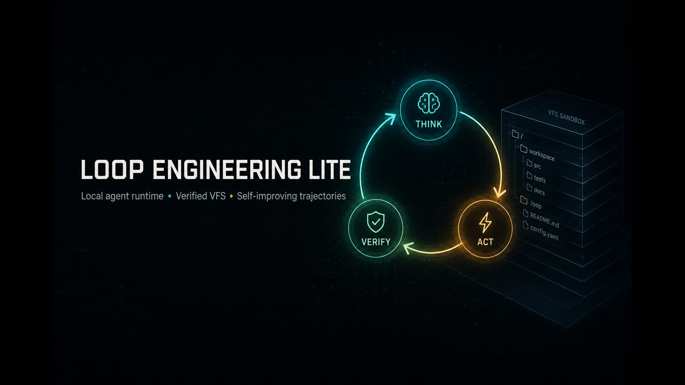
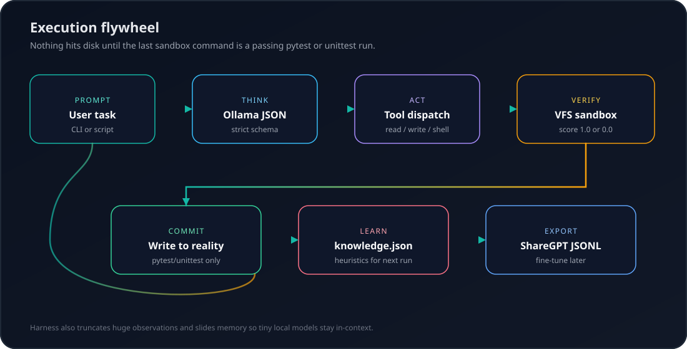

<p align="center">
  
</p>

<h1 align="center">Loop Engineering Lite</h1>

<p align="center">
  <strong>A local agent runtime that treats the filesystem as a world model.</strong><br>
  Think → act → <em>simulate</em> → commit only if tests (or the command) actually passed.
</p>

<p align="center">
  <a href="LICENSE"></a>
  <a href="https://www.python.org/downloads/"></a>
  
  
  <a href="docs/NORTH_STAR.md"></a>
</p>

<p align="center">
  <a href="docs/getting-started.md">Get started</a> ·
  <a href="docs/architecture.md">Architecture</a> ·
  <a href="examples/">Examples</a> ·
  <a href="docs/NORTH_STAR.md">North star</a> ·
  <a href="CONTRIBUTING.md">Contribute</a>
</p>

---

Most “autonomous coding agents” talk to your real disk on every tool call.
This one does not.

**Loop Engineering Lite** is a tiny Python harness (no LangChain, no cloud
required) that:

1. Forces a local Ollama model to speak **strict JSON** (thought, tool, status).
2. Applies file and shell actions to an in-memory **virtual file system**.
3. Materializes that VFS in a **tempdir**, runs the command, and scores it `1.0` or `0.0`.
4. Writes to your machine **only after** a successful simulation (or a verified complete).
5. Optionally **remembers** a heuristic in `knowledge.json` and **exports** the trace as JSONL for later fine-tuning.

That is the whole product. The [north star](docs/NORTH_STAR.md) is larger.
We keep those two documents separate on purpose.

## See it

<!-- pulse:start -->
<p align="center">
  <a href="docs/pulse.md"></a>
</p>

<p align="center"><sub>CI last redrew this README 2026-08-29 13:11 UTC. Live totals: 0 stars, 0 forks, 0 watchers, 7 open issues/PRs, 2 listed contributors (<code>cursoragent</code>, <code>jeremy-jaeger</code>). Star count is unchanged since the previous sample. The particle field and sparkline are generated from those numbers (<a href="scripts/generate_pulse.py">how</a>).</sub></p>
<!-- pulse:end -->

<p align="center">
  
</p>

<p align="center">
  
</p>

```mermaid
sequenceDiagram
    participant You
    participant Loop as loop.py
    participant LLM as Ollama
    participant VFS as vfs.py
    You->>Loop: python3 main.py "Use TDD to..."
    Loop->>LLM: messages + JSON schema
    LLM-->>Loop: tool_call write_file / run_command
    Loop->>VFS: mutate dict / simulate in tempdir
    VFS-->>Loop: [SIMULATION VERIFIED SUCCESS] or FAIL
    alt score 1.0 and status complete
        Loop->>VFS: commit_to_reality()
        Loop->>Loop: knowledge.json + dataset.jsonl
    else still in progress
        Loop->>LLM: observation truncated if huge
    end
```

## Quick start

**You need:** Python 3.9+ and [Ollama](https://ollama.com) with a chat model.

```bash
git clone https://github.com/jeremy-jaeger/loop-engineering-lite.git
cd loop-engineering-lite
ollama pull qwen3.5:0.8b

# Run from a throwaway directory so a successful commit cannot clobber the repo
mkdir -p /tmp/lel-demo && cd /tmp/lel-demo
python3 /path/to/loop-engineering-lite/main.py \
  "Use TDD to write is_palindrome(s) in str_utils.py. Test racecar, hello, and ''."
```

Unit tests (no model, no network):

```bash
cd loop-engineering-lite
python3 -m pip install -e ".[dev]"
python3 -m pytest -q
python3 examples/offline_vfs_demo.py
```

Full walkthrough: **[docs/getting-started.md](docs/getting-started.md)**.  
Copy-paste tasks: **[examples/prompts/starter.md](examples/prompts/starter.md)**.

## Why it exists

| Slogan you have heard | What we actually ship |
| --- | --- |
| World-model runtime | A **file/command sandbox** with a binary rollout score |
| Self-improving agent | Prompt-injected **heuristics** + JSONL traces (weights optional, later) |
| Drop-in for any framework | A **50–100 line loop** you can read in one sitting |
| Safe coding agent | **Not a container.** Tempdir + commit. Read [SECURITY.md](SECURITY.md) |

If that table feels too honest for GitHub, this is still the right repo for you.

## Layout

```text
main.py            CLI (python3 main.py "…")
loop.py            iterations, memory slide, interventions
llm_client.py      Ollama chat + schema + learned rules
tools.py           list / read / write / replace / run
vfs.py             world model (dict → tempdir → maybe disk)
memory.py          knowledge.json + dataset.jsonl
knowledge.json     surviving lessons from past runs
docs/              architecture, ADRs, FAQ, graphics
examples/          prompts, offline demo, prior TDD artifacts
scripts/           dataset batch + live pulse graphic
tests/             stdlib tests
```

## Tools the model is allowed to call

| Tool | Arguments | Effect |
| --- | --- | --- |
| `list_files` | `directory` (ignored; VFS is flat keys) | Keys currently in the sandbox |
| `read_file` | `filepath` | Contents with line numbers |
| `write_file` | `filepath`, `content` | Upsert in VFS only |
| `search_and_replace` | `filepath`, `old_code`, `new_code` | Exact-match edit |
| `run_command` | `command` | Shell in a **temp copy** of the VFS |

Default system prompt grounds the model on `python3` / `python3 -m pytest`.
Change that string in `llm_client.py` if you are not on that planet.

## Self-improvement, without the trenchcoat

On success the loop:

1. Commits the sandbox to disk  
2. Appends the message trace to `dataset.jsonl` (ShareGPT-style `{ "messages": ... }`)  
3. Asks a small model to extract a **generalized rule** into `knowledge.json`

Next runs prepend those rules. That is [experience replay into context](docs/self-improvement.md),
which we refuse to market as RSI. Use `scripts/generate_dataset.sh` when you
want a pile of verified TDD traces for LoRA.

## Status

**v0.1.0 alpha.** The loop, VFS, tools, truncation, reflection, and export are
real and tested at the unit level. Live quality depends entirely on the local
model. Fine-tuning, swarm spawn, and a general video/action world model are
[roadmap language](docs/NORTH_STAR.md), not checkboxes.

## Contributing

Please read [CONTRIBUTING.md](CONTRIBUTING.md) and the
[Code of Conduct](CODE_OF_CONDUCT.md). Bug reports want a prompt and a log;
see the issue templates.

```bash
python3 -m pytest -q
```

## Cite

```bibtex
@software{loop_engineering_lite,
  author = {Jaeger, Jeremy},
  title  = {Loop Engineering Lite},
  year   = {2026},
  url    = {https://github.com/jeremy-jaeger/loop-engineering-lite},
  version = {0.1.0}
}
```

Or use [`CITATION.cff`](CITATION.cff).

## License

[MIT](LICENSE) © 2026 jeremy-jaeger
