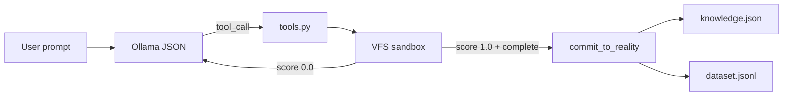

# Architecture

Loop Engineering Lite is a **small Python harness**, not a training framework.

A local model (via [Ollama](https://ollama.com)) emits **one JSON object per step**.
The harness either runs a tool against an in-memory **virtual file system**, or it
stops. Shell commands never execute on your real tree first: they run in a
tempdir snapshot. If the process exits 0, the snapshot may be committed.



## Implemented today

| Piece | Module | Job |
| --- | --- | --- |
| Loop | `loop.py` | Iterations, memory slide, lazy-complete retry, tool dispatch |
| Inference | `llm_client.py` | Ollama `/api/chat` + JSON schema + injected lessons |
| World model | `vfs.py` | Dict of files, tempdir rollouts, commit |
| Tools | `tools.py` | list / read / write / replace / run |
| Memory | `memory.py` | Heuristics + ShareGPT-ish JSONL export |
| CLI | `main.py` | `python3 main.py "…"` |

## Guardrails in the loop

1. **Tool enforcement** — `in_progress` without a `tool_call` is rejected.
2. **Lazy complete** — `status: complete` with an empty answer is rejected unless the last observation already verified success.
3. **Horizontal truncation** — observations longer than 3k characters keep head + tail.
4. **Vertical compaction** — when the message list exceeds `max_memory_items`, keep the original prompt and the last few turns.

## What is *not* implemented yet

The north star talks about general world models, swarm spawning, and weight
updates. Those are **goals**. The VFS is a *compositional file world*, not
Dreamer/JEPA. Reflection is heuristic injection, not recursive self-improvement
of weights. See [NORTH_STAR.md](NORTH_STAR.md) and [adr/](adr/).

## File layout

```
main.py                 CLI
loop.py                 runtime
llm_client.py           Ollama + system prompt
tools.py                tool router
vfs.py                  sandbox
memory.py               learn + export
knowledge.json          surviving heuristics
scripts/generate_dataset.sh
examples/               prompts and prior TDD artifacts
docs/                   this guide, ADRs, assets
tests/                  stdlib tests (no Ollama)
```
