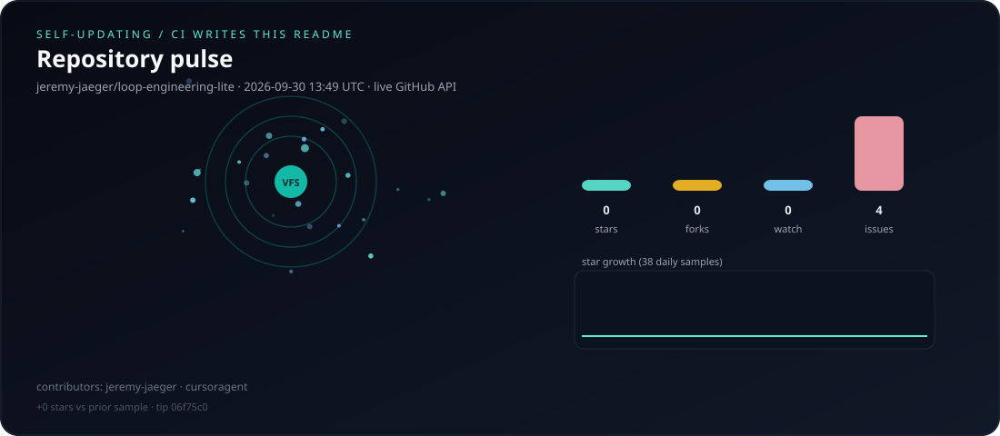

# Pulse

GitHub Actions **rewrites** `docs/assets/pulse.svg`, this page, `docs/pulse-history.json`,
and the marked section of `README.md` from the public GitHub API.

We do **not** call an LLM to invent marketing copy. The runner has no model,
and a model that can rewrite the README is a gift to prompt injection.

Last draw: `2026-10-01 14:31 UTC` · source `jeremy-jaeger/loop-engineering-lite` · API `ok`

CI last redrew this README **2026-10-01 14:31 UTC**. Live totals: **0** stars, **0** forks, **0** watchers, **4** open issues/PRs, **2** listed contributors (`jeremy-jaeger`, `cursoragent`). Star count is unchanged since the previous sample. The particle field and sparkline are generated from those numbers ([how](scripts/generate_pulse.py)).

| Metric | Value |
| --- | ---: |
| Stars | 0 |
| Forks | 0 |
| Watchers | 0 |
| Open issues + PRs | 4 |
| Contributors (sample) | jeremy-jaeger, cursoragent |
| Tip SHA | `559345b` |
| History samples | 39 |

GitHub description at draw time:

> The ultimate objective of this project is to create a runtime that any model or framework can plug into—turning inference trajectories into continuous, verifiable capability growth.

## Recent samples

| Date (UTC) | Stars | Forks | Watch | Issues |
| --- | ---: | ---: | ---: | ---: |
| 2026-09-18 | 0 | 0 | 0 | 4 |
| 2026-09-19 | 0 | 0 | 0 | 4 |
| 2026-09-20 | 0 | 0 | 0 | 4 |
| 2026-09-21 | 0 | 0 | 0 | 4 |
| 2026-09-22 | 0 | 0 | 0 | 4 |
| 2026-09-23 | 0 | 0 | 0 | 4 |
| 2026-09-24 | 0 | 0 | 0 | 4 |
| 2026-09-25 | 0 | 0 | 0 | 4 |
| 2026-09-26 | 0 | 0 | 0 | 4 |
| 2026-09-27 | 0 | 0 | 0 | 4 |
| 2026-09-28 | 0 | 0 | 0 | 4 |
| 2026-09-29 | 0 | 0 | 0 | 4 |
| 2026-09-30 | 0 | 0 | 0 | 4 |
| 2026-10-01 | 0 | 0 | 0 | 4 |

